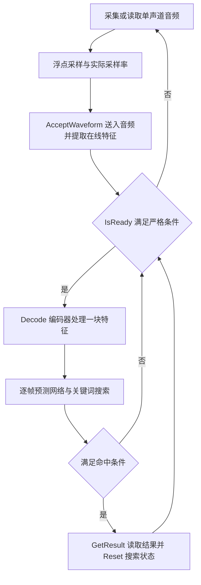
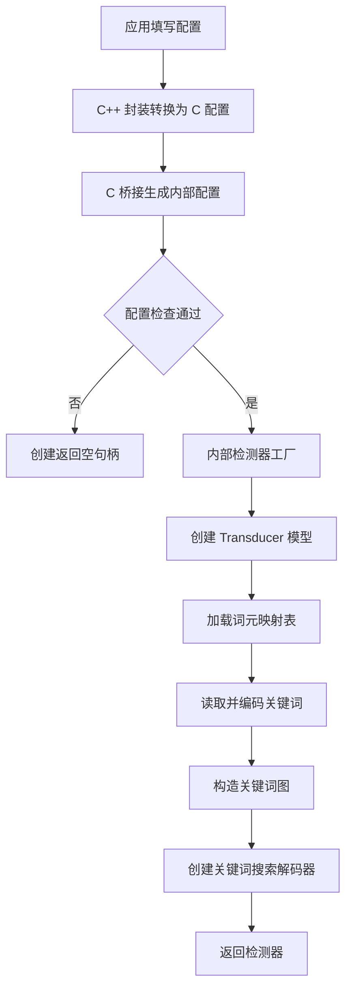
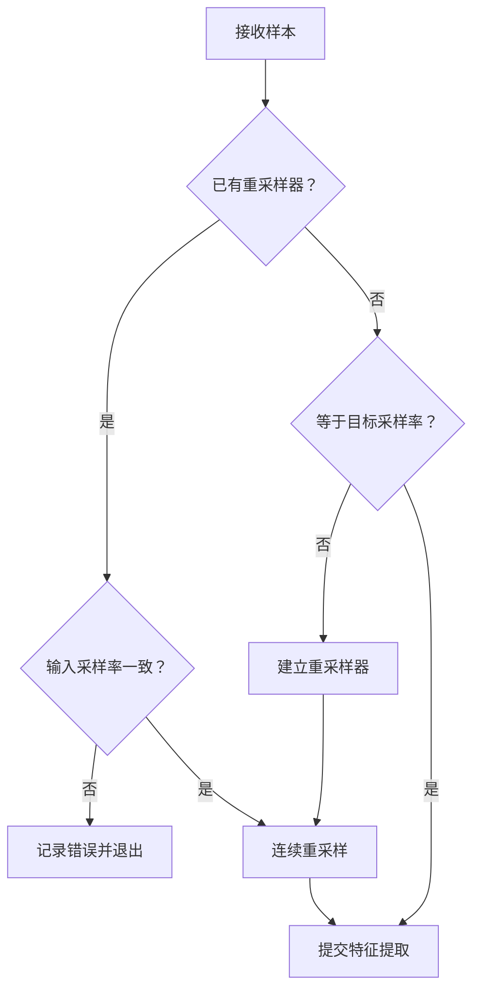
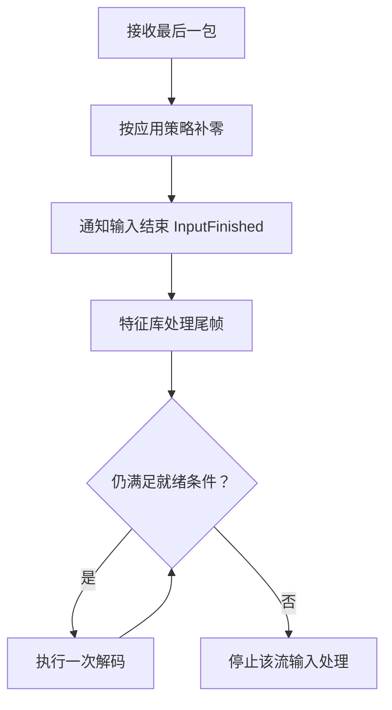
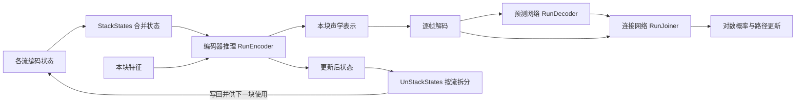
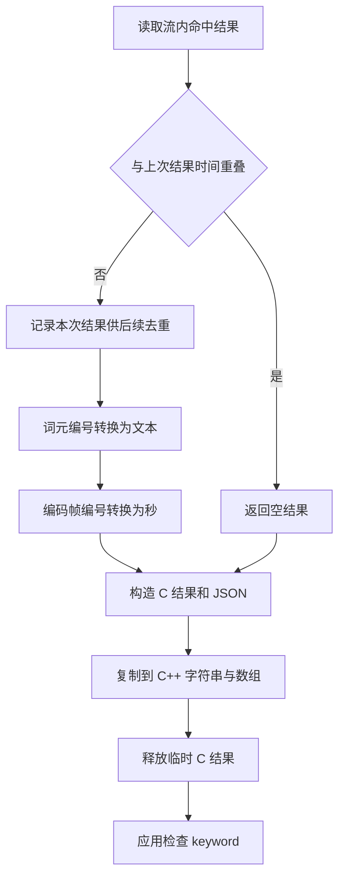
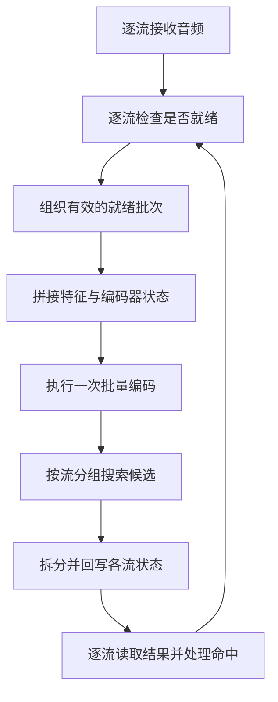

sherpa-onnx 的 C++ 关键词检测以 ONNX Runtime 上的流式 Transducer（Zipformer2）为主路径，公共入口是 `sherpa_onnx::cxx::KeywordSpotter`。C++ 封装以 RAII 与移动语义自动管理底层 C 句柄，并原生支持一次批量解码多路音频流。

本文的接口签名、默认值与边界条件依据源码基线 [`9f474b82`](https://github.com/k2-fsa/sherpa-onnx/tree/9f474b820e29ad8ba271c07c229ab4d9ed46a527)。所有 `sherpa-onnx/...` 源码链接都固定到该提交，可与本地 `git show 9f474b82:路径` 对照。文中"内部"默认指 `sherpa_onnx` 命名空间；公共封装标记为 `sherpa_onnx::cxx`；C 函数使用 `SherpaOnnx` 前缀。

## 概述

### 两个头文件与命名空间

| 头文件 | 命名空间 | 用途 |
| --- | --- | --- |
| `sherpa-onnx/c-api/cxx-api.h` | `sherpa_onnx::cxx` | 轻量 C++ 封装层，链接 C ABI，适合动态库与常规接入。`KeywordSpotter`、`OnlineStream`、`KeywordResult`、`KeywordSpotterConfig` 均在此定义 |
| `sherpa-onnx/csrc/keyword-spotter.h` | `sherpa_onnx` | 完整实现头，`KeywordSpotter` 经 Pimpl 委托 `KeywordSpotterImpl`，`KeywordResult` 提供 `AsJsonString()` |
| `sherpa-onnx/csrc/keyword-spotter-transducer-impl.h` | `sherpa_onnx` | Transducer 实现：关键词图、特征分块、模型调用与流状态管理 |

这两组 `KeywordSpotter` 和 `OnlineStream` 属于不同命名空间，签名也不同。例如，公共封装的 `Decode(const OnlineStream *s) const` 经 C 桥接调用内部 `DecodeStream(OnlineStream *s) const`，后者再包装为 `DecodeStreams(OnlineStream **ss, int32_t n) const`。本文用完整限定名区分它们。

### 接口分层

| 层级 | 类型或函数前缀 | 职责 |
| --- | --- | --- |
| 应用 C++ 接口 | `sherpa_onnx::cxx::KeywordSpotter`、`OnlineStream` | 配置、自动释放资源、送入音频、解码、复制结果 |
| C 接口桥接 | `SherpaOnnx...` | 在 C 句柄和内部 C++ 对象之间转发，转换配置与结果 |
| 内部检测器 | `sherpa_onnx::KeywordSpotter` | 委托具体检测实现 |
| Transducer 实现 | `KeywordSpotterTransducerImpl` | 关键词图、特征分块、模型调用和流状态管理 |
| 模型与搜索 | `OnlineTransducerModel`、`TransducerKeywordDecoder`、`ContextGraph` | 神经网络计算、候选搜索和命中判断 |

### C++ API 与 C API 的主要区别

| 特性 | C API | C++ API |
| --- | --- | --- |
| **内存管理** | 手动调用 `Destroy*` 系列函数 | `MoveOnly` RAII，析构自动释放句柄 |
| **接口风格** | 过程式，全局函数 + 不透明指针 | 面向对象，`KeywordSpotter` 类封装 |
| **并发解码** | 需自行组织流指针数组 | `Decode(ss, n)` 原生支持批量解码 |
| **错误处理** | 返回 `NULL` 指针检查 | 用 `.Get()` 检查空句柄 |
| **字符串类型** | `const char *` | `std::string` |

### 从采样到唤醒事件



`AcceptWaveform` 负责音频和特征，`Decode` 负责一次模型分块与搜索。应用通过 `while (IsReady(...))` 消费已经就绪的块，并在每次 `Decode` 后读取一次结果。这里的网络"解码器"指预测网络 `RunDecoder`；搜索解码器指 `TransducerKeywordDecoder::Decode`，两者职责不同。

---

## 核心类与结构体

### KeywordResult 结构体

两个命名空间各有一个同名结构体，字段不同：

```cpp
// sherpa-onnx/c-api/cxx-api.h  ——  sherpa_onnx::cxx
struct KeywordResult {
  std::string keyword;                 // 触发的关键词文本
  std::vector<std::string> tokens;     // 解码得到的 token 序列
  std::vector<float> timestamps;       // 每个 token 的解码时间（秒）
  float start_time = 0.0f;             // 片段起始时间（秒）
  std::string json;                    // 结果的 JSON 表示
};
```

```cpp
// sherpa-onnx/csrc/keyword-spotter.h  ——  sherpa_onnx
struct KeywordResult {
  std::string keyword;
  std::vector<std::string> tokens;
  std::vector<float> timestamps;
  float start_time = 0;
  std::string AsJsonString() const;    // 按需生成 JSON
};
```

<ParamField path="keyword" type="std::string">
  触发的关键词。英文为空格分隔单词，如 `"hello world"`；中文为连续汉字，如 `"你好世界"`。为 `empty()` 时表示本次未触发。
</ParamField>

<ParamField path="tokens" type="std::vector<std::string>">
  解码得到的 token 序列。BPE 模型为子词单元，字符级中文模型为单字。
</ParamField>

<ParamField path="timestamps" type="std::vector<float>">
  每个 token 的解码时间（秒），`timestamps.size() == tokens.size()`。
</ParamField>

<ParamField path="start_time" default="0.0" type="float">
  当前片段的起始时间（秒），端点检测更新片段时会变化。
</ParamField>

<Warning>
  JSON 字段只保留小数点后两位。需要完整精度时读取结构体中的浮点数组。`cxx` 命名空间的 `KeywordResult` 已经把 C 结果复制成 `std::string` 与 `std::vector`，因此重置或销毁流后仍可继续使用。
</Warning>

### KeywordSpotterConfig 结构体

```cpp
// namespace sherpa_onnx::cxx
struct KeywordSpotterConfig {
  FeatureConfig     feat_config;
  OnlineModelConfig model_config;

  int32_t max_active_paths    = 4;      // 每帧保留的最大候选路径数
  int32_t num_trailing_blanks = 1;      // 确认命中所需的尾随空白帧数
  float   keywords_score      = 1.0f;   // 关键词路径分数加成
  float   keywords_threshold  = 0.25f;  // 命中声学阈值 [0, 1]

  std::string keywords_file;            // 关键词文件路径
  std::string keywords_buf;             // 内存中的关键词文本（与文件二选一）
};
```

常用嵌套字段：

| 字段 | 默认值或要求 | 用途 |
| --- | --- | --- |
| `feat_config.sample_rate` | `16000` | 特征提取的目标采样率，应匹配模型训练设置 |
| `feat_config.feature_dim` | `80` | 每帧特征维度 |
| `model_config.transducer.encoder` | 指定文件路径 | 编码器模型 |
| `model_config.transducer.decoder` | 指定文件路径 | 词元上下文预测网络 |
| `model_config.transducer.joiner` | 指定文件路径 | 连接网络 |
| `model_config.tokens` | 指定文件路径 | 模型词元与整数编号的映射 |
| `model_config.tokens_buf` | 默认空 | 使用内存中的词元表内容 |
| `model_config.provider` | `"cpu"` | 模型执行后端 |
| `model_config.num_threads` | `1` | 推理线程配置，不代表并发音频流数 |
| `model_config.debug` | `false` | 输出模型及配置调试信息 |
| `keywords_file`、`keywords_buf` | 二选一 | 关键词定义的文件或内存文本 |

<Note>
  公共 `OnlineModelConfig` 复用语音识别配置，还含有 CTC、Paraformer 等字段；本文 KWS 工厂实际选择的是 Transducer 路径，不能由结构体中存在其他字段推断 KWS 支持这些模型。C 桥接层通过 `SHERPA_ONNX_OR(x, y)` 把若干数值 `0` 替换为默认值：例如把公共 `num_trailing_blanks` 设为 `0`，进入内部的值仍为 `1`。调参时应检查桥接后的实际配置。
</Note>

### KeywordSpotter 类

```cpp
// namespace sherpa_onnx::cxx
namespace sherpa_onnx::cxx {

// OnlineStream 的公开成员
void AcceptWaveform(int32_t sample_rate, const float *samples, int32_t n) const;
void InputFinished() const;

// KeywordSpotter 的公开成员
static KeywordSpotter Create(const KeywordSpotterConfig &config);
OnlineStream CreateStream() const;
OnlineStream CreateStream(const std::string &keywords) const;
bool IsReady(const OnlineStream *s) const;
void Decode(const OnlineStream *s) const;
void Decode(const OnlineStream *ss, int32_t n) const;
void Reset(const OnlineStream *s) const;
KeywordResult GetResult(const OnlineStream *s) const;

}  // 以上是成员声明摘录，不是独立可编译代码。
```

| 调用 | 输入与前提 | 返回或状态变化 |
| --- | --- | --- |
| `KeywordSpotter::Create(config)` | 模型、词元表、关键词定义和参数 | 返回拥有检测器句柄的对象；用 `Get()` 检查句柄 |
| `kws.CreateStream()` | 已创建的检测器 | 新建特征状态、搜索结果、编码器初始状态，绑定默认关键词图 |
| `stream.AcceptWaveform(rate, samples, n)` | 实际输入采样率，`n` 个单声道浮点采样 | 追加音频并更新可用特征帧 |
| `kws.IsReady(&stream)` | 当前流 | 判断能否执行一块解码，不进行模型推理 |
| `kws.Decode(&stream)` | `IsReady` 为真 | 前移特征读取位置，运行编码器和搜索，保存新状态 |
| `kws.GetResult(&stream)` | 通常紧跟一次 `Decode` | 返回独立 C++ 结果副本，并触发内部重复结果过滤 |
| `kws.Reset(&stream)` | 应用已消费一次非空结果 | 重新初始化搜索和编码器状态；具体保留项见下文 |
| `stream.InputFinished()` | 音源永久结束 | 通知特征提取器结束输入，之后仍须排空可解码块 |

### MoveOnly 与资源所有权

公共 `KeywordSpotter` 和 `OnlineStream` 都继承 `MoveOnly`。该模板删除复制构造及复制赋值，实现移动构造、移动赋值和析构时释放句柄。通常由局部变量或成员变量管理资源，不需要手工调用 `Destroy`。

```cpp
// MoveOnly<Derived, T> 的成员签名
const T *Get() const;
const T *Release();
MoveOnly(const MoveOnly &) = delete;
MoveOnly &operator=(const MoveOnly &) = delete;
MoveOnly(MoveOnly &&other);
MoveOnly &operator=(MoveOnly &&other);
~MoveOnly();
```

`Get()` 借用底层句柄；`Release()` 转移释放责任，调用后封装对象不再拥有该句柄。接入代码使用 `Get()` 检查创建是否成功即可。检测器应在其流仍需解码时保持有效，示例利用成员声明顺序使流先于检测器析构。

<Note>
  `const OnlineStream *` 约束的是外层封装对象，内部流仍会更新状态，这个限定不构成并发调用保证。公共批量重载接收连续存放的 `OnlineStream` 对象；内部批量方法接收流指针数组，二者不可互换。
</Note>

---

## 完整流式示例

以下示例类使用公共 `cxx-api.h`，从音频文件按 20 毫秒分包送入，每包后排空可解码块，命中后复制结果并重置，最后补入静音并结束输入。

```cpp
// 从文件按 20 毫秒分包，执行与实时采集相同的流式送入和解码循环。
// 配套源文件：docs/kws-cpp-api/examples/streaming-kws.cc
#include <algorithm>
#include <cstdint>
#include <iostream>
#include <stdexcept>
#include <string>
#include <vector>

#include "sherpa-onnx/c-api/cxx-api.h"

namespace cxx = sherpa_onnx::cxx;

class StreamingKws {
 public:
  explicit StreamingKws(const cxx::KeywordSpotterConfig &config)
      : spotter_(cxx::KeywordSpotter::Create(config)),
        stream_(spotter_.CreateStream()) {
    if (!spotter_.Get() || !stream_.Get()) {
      throw std::runtime_error("创建关键词检测器或音频流失败");
    }
  }

  // 由同一工作线程按顺序调用。samples 是单声道、归一化浮点采样。
  void Accept(int32_t sample_rate, const float *samples, int32_t count) {
    if (finished_) throw std::logic_error("输入已经结束");
    if (sample_rate <= 0 || count < 0 || (count > 0 && samples == nullptr)) {
      throw std::invalid_argument("音频参数无效");
    }
    if (count == 0) return;
    if (input_sample_rate_ != 0 && input_sample_rate_ != sample_rate) {
      throw std::invalid_argument("同一条流必须保持输入采样率一致");
    }
    input_sample_rate_ = sample_rate;
    stream_.AcceptWaveform(sample_rate, samples, count);
    DrainReady();
  }

  // 只在音源永久结束时调用一次。0.5 秒是示例值，实际应验证模型尾部需求。
  void Finish() {
    if (finished_) return;
    if (input_sample_rate_ > 0) {
      std::vector<float> padding(static_cast<size_t>(input_sample_rate_ / 2),
                                 0.0f);
      Accept(input_sample_rate_, padding.data(),
             static_cast<int32_t>(padding.size()));
    }
    stream_.InputFinished();
    finished_ = true;
    DrainReady();
  }

 private:
  void DrainReady() {
    while (spotter_.IsReady(&stream_)) {
      spotter_.Decode(&stream_);
      const auto result = spotter_.GetResult(&stream_);
      if (!result.keyword.empty()) {
        // result 已拥有独立副本，重置后仍可用于业务处理。
        spotter_.Reset(&stream_);
        std::cout << result.json << '\n';
      }
    }
  }

  // 成员按声明的逆序析构，使流先于检测器销毁。
  cxx::KeywordSpotter spotter_;
  cxx::OnlineStream stream_;
  int32_t input_sample_rate_ = 0;
  bool finished_ = false;
};

int main(int argc, char **argv) {
  if (argc != 7) {
    std::cerr << "用法：" << argv[0]
              << " encoder.onnx decoder.onnx joiner.onnx tokens.txt"
                 " keywords.txt audio.wav\n";
    return 2;
  }

  try {
    cxx::KeywordSpotterConfig config;
    config.model_config.transducer.encoder = argv[1];
    config.model_config.transducer.decoder = argv[2];
    config.model_config.transducer.joiner = argv[3];
    config.model_config.tokens = argv[4];
    config.keywords_file = argv[5];
    config.model_config.provider = "cpu";
    config.model_config.num_threads = 1;
    config.feat_config.sample_rate = 16000;  // 必须与模型训练设置一致。
    config.feat_config.feature_dim = 80;

    const auto wave = cxx::ReadWave(argv[6]);
    if (wave.samples.empty() || wave.sample_rate <= 0) {
      std::cerr << "读取音频失败：" << argv[6] << '\n';
      return 1;
    }

    StreamingKws session(config);
    const size_t packet_size =
        std::max<size_t>(1, static_cast<size_t>(wave.sample_rate / 50));
    for (size_t offset = 0; offset < wave.samples.size();) {
      const size_t count =
          std::min(packet_size, wave.samples.size() - offset);
      session.Accept(wave.sample_rate, wave.samples.data() + offset,
                     static_cast<int32_t>(count));
      offset += count;
    }
    session.Finish();
  } catch (const std::exception &e) {
    std::cerr << e.what() << '\n';
    return 1;
  }
  return 0;
}
```

`StreamingKws` 是本文的应用层示例类，不是 sherpa-onnx 提供的类型。库函数分别映射到上表的公共声明，原仓库用法可对照 [`cxx-api-examples/kws-cxx-api.cc`](https://github.com/k2-fsa/sherpa-onnx/blob/9f474b820e29ad8ba271c07c229ab4d9ed46a527/cxx-api-examples/kws-cxx-api.cc)。

示例约束有明确目的：同一流始终使用相同的实际输入采样率；结束后不再送入音频；每次解码只读取一次结果；打印使用已复制的结果。尾部静音按实际输入采样率计算，长度为半秒，沿用仓库示例的习惯，目标模型仍须验证尾部命中是否完整。

---

## 初始化与关键词定义

### 初始化路径



| 步骤 | 实际签名 |
| --- | --- |
| 公共创建 | `static KeywordSpotter Create(const KeywordSpotterConfig &config)` |
| 实现工厂 | `std::unique_ptr<KeywordSpotterImpl> KeywordSpotterImpl::Create(const KeywordSpotterConfig &config)` |
| Transducer 初始化 | `explicit KeywordSpotterTransducerImpl(const KeywordSpotterConfig &config)` |

构造函数先建立 `OnlineTransducerModel`，读取符号表中的 `<unk>` 编号（不存在时为 `-1`），再设置特征维度。关键词图绑定全局加分和声学阈值；搜索器接收 `max_active_paths`、`num_trailing_blanks` 和未知词元编号。图中的配置失败分支对应 `Validate` 返回 `false`；更深层的模型加载或关键词解析还可能记录错误、抛出异常或终止进程，不能把所有失败都视为返回空句柄。

### 关键词文本的格式

关键词定义由空格分隔的模型词元组成，每行一个目标词。可在该行添加 `:加分`、`#阈值`、`@返回文本`。下面只是格式示例，词元必须存在于所用模型的 `tokens.txt` 中。

```text
x iǎo ài tóng x ué :1.5 #0.35 @小爱同学
y ǎn y uán :1.0 #0.25 @演员
```

`EncodeKeywords` 按行读取定义，`EncodeBase` 逐项查词元表，再识别前缀标记。它不在运行时把任意中文句子转换为拼音，也不执行子词分词；拼音、子词或字粒度应与模型词元表一致。需要从原始文本生成定义时，使用与模型配套的离线转换工具（如 `text2token`）。

```cpp
// namespace sherpa_onnx；utils.h
bool EncodeKeywords(std::istream &is, const SymbolTable &symbol_table,
                    std::vector<std::vector<int32_t>> *keywords_id,
                    std::vector<std::string> *keywords,
                    std::vector<float> *boost_scores,
                    std::vector<float> *threshold);
```

词元未登录会使该函数返回 `false`；数值格式应能由 `std::stof` 解析。

<Warning>
  `#` 表示阈值，不是注释标记。`@` 后的返回文本按空白分项读取，含空格的显示词组应改用下划线等约定表示，避免后续词被当成模型词元。
</Warning>

### 默认流与定制流

```cpp
// namespace sherpa_onnx::cxx
OnlineStream KeywordSpotter::CreateStream() const;
OnlineStream KeywordSpotter::CreateStream(const std::string &keywords) const;

// namespace sherpa_onnx；内部实现的成员声明
std::unique_ptr<OnlineStream> CreateStream() const override;
std::unique_ptr<OnlineStream> CreateStream(
    const std::string &keywords) const override;
void InitOnlineStream(OnlineStream *stream) const;
```

无参数版本直接共享检测器中的默认关键词图。有参数版本先把 `/` 替换为换行，解析本次定义，再把检测器的默认词元编号、显示文本、加分和阈值附加进去，构造该流自己的图。它在当前实现中是"新增词与默认词合并"：

```cpp
// 在默认集合上增加两个词
OnlineStream stream = kws.CreateStream("y ǎn y uán @演员/zh ī m íng @知名");
```

`InitOnlineStream` 从 `GetEmptyResult` 取得唯一一条初始候选，把其 `context_state` 设为图根节点，再设置关键词结果和编码器初始缓存。

---

## 音频输入与在线特征

### 接收单声道浮点样本

应用传入的是一维单声道浮点 PCM 数组。`sample_rate` 表示该数组的真实采样率（Hz）；`n` 表示样本个数，不是字节数、特征帧数或双声道采样对数。样本应预先归一化到 `[-1, 1]`，多声道选择或混合由应用完成。

<Warning>
  16 位有符号 PCM 应先按浮点运算除以 `32768.0f`，不能通过指针类型转换变成有效浮点样本。
</Warning>

`normalize_samples` 的默认值为 `true`，此分支直接传递已归一化的输入，并不自动调整振幅。当内部配置为 `false` 时，代码才创建临时数组，将每个样本乘以 `32768`。因此，不能把该字段理解为自动归一化开关。C 桥接函数仅检查 `stream` 是否为空，未在这一层逐项验证样本值、采样率或数组长度。应用应保证缓冲区在调用期间有效，并在将容器长度转换为 `int32_t` 前确认其范围。

### 区分输入采样率与特征采样率

公共 `FeatureConfig::sample_rate` 默认 `16000`，经 KWS 配置转换进入核心 `FeatureExtractorConfig::sampling_rate`，决定特征提取器使用的采样率；`AcceptWaveform()` 的采样率参数则描述本次输入。两者不同会触发内部重采样。



已有重采样器时，输入采样率必须等于其建立时的输入采样率，否则记录错误并终止。尚未建立时，遇到与目标采样率不同的输入才创建对象。因此，代码并非从第一包开始无条件锁定采样率，但应用仍应让一条连续音频流保持同一输入采样率。

例如，采集端以 48 kHz 产生的 960 个样本对应 20 ms，提交时仍应声明 `48000`。如果仅把参数改成 `16000`，代码会将这 960 个样本视为 60 ms，并绕过所需的重采样分支。修改采样率标签不会改变样本序列。

### 在线特征与缓存

公共 C++ `FeatureConfig` 只包含 `sample_rate` 和 `feature_dim`，默认分别为 `16000` 和 `80`。其他特征参数沿用核心结构体默认值（梅尔滤波器组、25 ms 帧长、10 ms 帧移、Povey 窗、预加重 `0.97`，见 `sherpa-onnx/csrc/features.h`）；不能将核心字段误写成公共 C++ KWS 配置项。

核心流先将读取起点加上 `start_frame_index_`。特征提取器检查 `frame_index + n` 不超过可用帧上界，并要求起点不小于上次读取起点。随后计算 `discard_num = frame_index - last_frame_index_`，丢弃旧前缀，再复制所需帧。返回值是按行展开的一维 `std::vector<float>`，逻辑形状为 `[n, feature_dim]`。

<Note>
  `NumFramesReady()` 不能解释为物理缓存中尚存的帧数。若应用持续输入却不及时解码，源码没有给出可据以承诺固定内存上限的背压机制。在持续运行的应用中应随音频到达及时执行就绪循环，使读取起点正常前进，旧前缀才有机会被丢弃。每包都建立新流会失去跨包状态，不适合作为同一段连续音频的接入方式。
</Note>

---

## 就绪条件与输入结束

音频包、特征帧和模型输入块使用不同单位。应用提交一包样本后，先让在线特征提取器更新可用帧，再由 KWS 的就绪条件决定能否处理下一块。

### 严格的可解码条件

`KeywordSpotterTransducerImpl::IsReady()` 的比较表达式如下：

```cpp
return s->GetNumProcessedFrames() + model_->ChunkSize() <
       s->NumFramesReady();
```

令 `P` 为已处理特征帧计数，`C` 为 `ChunkSize()`，`R` 为当前流的 `NumFramesReady()`。三个量均以输入特征帧计数。上述条件是 `P + C < R`，不是 `P + C <= R`。

| 剩余可用帧 `R - P` | `IsReady()` | 应用处理 |
| --- | --- | --- |
| 小于 `C` | `false` | 继续接收音频，或在输入结束后停止解码循环 |
| 等于 `C` | `false` | 恰好一个窗口仍未达到本实现的门槛 |
| 大于 `C` | `true` | 可以执行一次解码，之后重新检查 |

整数条件因此至少要求剩余 `C + 1` 帧，但实际取帧仍只有 `C` 帧。

<Warning>
  不要把该条件改写为"缓存够一块便可解码"。`ChunkSize()` 是本次需要读取的特征窗口长度，`ChunkShift()` 是本次推进的帧数，两者可以不同；接口将二者之差描述为右侧上下文长度。
</Warning>

例如，16 kHz 下的 20 ms 音频包包含 320 个样本，但帧长默认是 25 ms，帧移是 10 ms，解码窗口又由模型确定。因此，一包音频可以不触发解码，也可以使多次解码就绪。应用应在每次输入后用 `while (kws.IsReady(&stream))` 持续处理。

### 输入结束与重采样尾部

`InputFinished()` 表示应用不会再向这条流提供样本。它不接收文件描述符，也不自行探测 EOF；文件或设备输入层必须决定何时调用。调用后不应追加音频。

默认路径最终调用 `fbank_->InputFinished()`，使特征库按 `NumFrames(T, opts, true)` 补算新增帧。这里的 `T` 是特征库已接收的累计样本数，位于重采样之后，不包括仍滞留于内部重采样器的样本。

<Warning>
  必须分别看待特征结束和重采样结束。`FeatureExtractor::Impl::InputFinished()` 没有访问 `resampler_`，也没有执行 `Resample(..., true, ...)`；音频接收路径所有内部重采样调用均使用 `flush=false`。因此，当前的结束通知不会显式取出重采样器尚未输出的尾部样本，不能描述成"冲刷全部音频缓存"。
</Warning>

`InputFinished()` 也不会自动凑满模型窗口。KWS 的 `IsReady()` 中没有 EOF 或 `IsLastFrame()` 例外分支；结束后若剩余帧仍不满足严格比较，循环就会停止，即使还有少量未处理帧。

### 应用侧的 EOF 调用顺序



补零是应用策略，允许省略；一旦采用，必须在结束通知之前完成。仓库 C++ KWS 示例先建立 8000 个零样本，再提交原始音频、提交补零、调用 `InputFinished()`，最后循环检查 `IsReady()`。示例注释将这段补零称为 0.5 秒，但调用传入的是 `wave.sample_rate`，所以其真实时长是 `8000 / wave.sample_rate` 秒，仅在 16 kHz 时等于 0.5 秒。

```cpp
// 伪代码：按到达顺序接收音频包。
for (const auto &packet : audio_packets) {
  stream.AcceptWaveform(input_sample_rate, packet.data(),
                        static_cast<int32_t>(packet.size()));
  while (kws.IsReady(&stream)) {
    kws.Decode(&stream);
    // 此处衔接结果处理。
  }
}

// 伪代码：补零数量由应用和所用模型的验证结果确定。
if (!tail_padding.empty()) {
  stream.AcceptWaveform(input_sample_rate, tail_padding.data(),
                        static_cast<int32_t>(tail_padding.size()));
}
stream.InputFinished();
while (kws.IsReady(&stream)) {
  kws.Decode(&stream);
  // 此处衔接结果处理。
}
```

`Decode()` 的 C 桥接并不替应用重新执行 `IsReady()`；公共契约要求只对就绪流调用。建议对同一条流串行安排接收、结束通知、就绪检查和解码。

---

## 解码、命中与结果

### 编码器与逐帧搜索

`KeywordSpotterTransducerImpl::DecodeStreams` 把多条流的特征和状态组织成批次送入模型，再将更新后的状态交还各流。统一记号：`N` 为本次流数，`T` 为输入块长，`S` 为推进帧数，`F` 为特征维数，`U` 为编码器本次输出帧数，`H_t` 为输出帧 `t` 上所有流的候选路径总数。



对每条流，`DecodeStreams` 读取半开区间 `[p,p+T)`，得到按行展开的 `float[T,F]`，随后将游标增加 `S`。复制后形成连续的 `features_vec`，并据此构造 `x: float32[N,T,F]`。`T`、`S`、`p` 均以下采样前的特征帧计量；`F` 来自流的 `FeatureDim()`，不得固定写为某个下载模型的特征维数。

搜索阶段由 `TransducerKeywordDecoder::Decode` 遍历 `t=0…U-1`。每帧先展开所有流的候选路径，利用 `hyps_row_splits` 记录各流边界，得到本帧总路径数 `H_t`。预测网络的批次轴因此是 `H_t`，不能固定写成 `N` 或 `N×max_active_paths`。

### 命中条件

完整触发条件如下，比较符必须按源码区分：

| 检查项 | 实际条件 | 边界含义 |
| --- | --- | --- |
| 图状态匹配 | `matched == true` | 仅检查本帧所选最优候选 |
| 尾部空白 | `best_hyp.num_trailing_blanks > num_trailing_blanks_` | 严格大于配置值 |
| 声学均值 | `ys_prob >= matched_state->ac_threshold` | 等于阈值即可通过 |

令 `L = matched_state->level`。触发时以 `float` 累加 `best_hyp.ys_probs[0]` 至 `best_hyp.ys_probs[L-1]`，再除以 `L`。因此声学指标为这 `L` 项普通概率的算术平均值，既不是对数概率平均，也不是概率的几何平均，更不是合并后路径分数。

<Note>
  若内部配置 `num_trailing_blanks_ = 1`，计数至少达到 `2` 才通过。内部值为 `0` 时，首次普通词元发射后的计数仍为 `0`，须继续出现至少一个空白或被当作空白的未知词元。公共封装传入零值会回落为 `1`。`unk_id_` 从词元表的 `<unk>` 项取得，因此尾部空白计数也包含被当作空白处理的未知词元，不能直接解释为纯静音帧数。
</Note>

触发通过后，代码取 `best_hyp.ys` 的末尾 `L` 个词元写入 `r.tokens`，取 `best_hyp.timestamps` 的末尾 `L` 项写入 `r.timestamps`，再把 `matched_state->phrase` 写入 `r.keyword`。随后该流本帧的整个 `hyps` 被替换为仅含一条空上下文候选的集合，候选直接绑定当前图的根节点。

<Warning>
  一次命中不会提前结束帧循环。再次触发时，`tokens`、`timestamps`、`keyword` 被重新赋值，因而同一块最终保存该流最后一次成功触发的结果；代码没有在这里追加命中列表，也没有比较历次命中的分数后择优。
</Warning>

### GetResult 与重复结果过滤

公共 `GetResult` 先复制 C 结果，再调用 `SherpaOnnxDestroyKeywordResult` 释放临时结构。因此业务代码可以在重置或销毁流后继续使用已取得的 C++ 结果。

内部 `OnlineStream::GetKeywordResult(true)` 带有一个有副作用的重复过滤：若上次与本次时间戳数组均非空，且本次首词元帧号小于或等于上次末词元帧号，则返回空结果；否则更新 `prev_keyword_result_`。



<Warning>
  公共 `GetResult` 会改变后续读取行为。应用宜在每次 `Decode` 后读取一次，将取得的副本交给日志与业务模块。让两个模块分别对同一流调用 `GetResult`，可能使后一个模块得到空结果。`DecodeStreams` 开始时也会通过 `GetKeywordResult(true)` 检查尾随空白，因此它和结果读取共用这套过滤状态。
</Warning>

`Convert` 优先采用关键词定义中的显示文本。未设置显示文本时，它拼接词元字符串并去掉结果的第一个字节；该行为依赖词元表中的实际符号表示。拼音模型应提供 `@返回文本`，不能指望这一段拼接逻辑将拼音恢复为汉字。

### 时间戳的单位与适用范围

当前 `GetResult` 向 `Convert` 传入固定的 `frame_shift_ms = 10` 和 `subsampling_factor = 4`。对内部词元帧号 `t_i`，输出计算为：

```text
timestamps[i] = t_i × 10 / 1000 × 4 = t_i × 0.04 秒
start_time    = GetNumFramesSinceStart() × 10 / 1000 秒
```

这些常数是当前代码中的转换假定，实际模型的分块参数来自模型元数据，不能仅由时间换算公式推出模型结构。`timestamps[i]` 标记词元在解码中发出的编码帧，不能直接当作精确的语音边界；检测器还要等待后续空白与整个分块推理，应用收到事件的墙钟时间通常更晚。

<Warning>
  普通 KWS 路径存在一个时间基准限制：`KeywordSpotterTransducerImpl::Reset` 重新建立 `TransducerKeywordResult`，其 `frame_offset` 默认是 `0`；它没有调用内部 `OnlineStream::Reset`。因此特征读取进度继续累积，但搜索帧号重新计数，`GetNumFramesSinceStart()` 对应的 `start_frame_index_` 通常仍为 `0`。跨越显式重置或自动静音重置后，不能直接把 `start_time + timestamps[i]` 视为贯穿整个录音的绝对时间。若应用需要截取唤醒词原始音频，应独立维护输入采样计数、实际采样率和原始音频缓存。
</Warning>

### 四种不同的状态动作

| 动作 | 搜索候选 | 编码器缓存 | 特征读取进度与输入状态 | 关键词图 |
| --- | --- | --- | --- | --- |
| 搜索器在块内记录命中后 | 当前流候选回到初始空路径 | 保持本次编码器计算所得状态 | 继续当前块 | 保留 |
| 公共 `kws.Reset(&stream)` | 用空结果重新初始化，搜索帧偏移归零 | 取模型初始状态 | 不调用特征流的 `Reset`，不清除已送入音频，也不撤销输入结束标记 | 保留 |
| 解码前检测到长尾随空白 | 调用同一 KWS `Reset` | 同上 | 同上 | 保留 |
| 销毁旧流并 `CreateStream()` | 创建全新状态 | 创建初始状态 | 新建特征提取器，计数从头开始 | 默认图或新定制图 |

代码在下一次 `DecodeStreams` 的开头，将经重复过滤后结果中的尾随空白数乘以 `4 × 0.01`，当值严格大于 `1.5` 秒时自动重置（`num_trailing_blanks × 4 × 0.01 > 1.5` 判断，其中 `4` 和 `0.01` 是显式假设）。若过滤返回空结果，本次读到的空白数是 `0`。

<Note>
  持续监听过程中检测到一个关键词，随后还要接收音频时，应消费结果并调用 KWS `Reset`。若要开始一段完全独立的音频，创建新流能同时重建特征、重采样和搜索状态。结束通知作用于特征输入生命周期，不能借用 KWS 搜索重置来重新开放输入。
</Note>

---

## 多流批量解码

一个检测器可以创建多个流，各流维护自己的特征、搜索结果和编码器缓存。批量调用把就绪流的特征和状态组合成模型批次，搜索阶段再按流划分候选。

公共重载的参数是连续对象数组：

```cpp
// ss[0] 至 ss[n - 1] 必须都是已经就绪且有效的流。
void sherpa_onnx::cxx::KeywordSpotter::Decode(
    const OnlineStream *ss, int32_t n) const;
```

内部接口和 C 接口则使用指针数组：

```cpp
// sherpa_onnx 命名空间
void sherpa_onnx::KeywordSpotter::DecodeStreams(
    OnlineStream **ss, int32_t n) const;

// C 接口
void SherpaOnnxDecodeMultipleKeywordStreams(
    const SherpaOnnxKeywordSpotter *spotter,
    const SherpaOnnxOnlineStream **streams, int32_t n);
```

```cpp
#include "sherpa-onnx/c-api/cxx-api.h"
#include <iostream>
#include <vector>

using namespace sherpa_onnx::cxx;

constexpr int kNumStreams = 4;

std::vector<OnlineStream> streams;
streams.reserve(kNumStreams);
for (int i = 0; i < kNumStreams; ++i) {
  streams.push_back(kws.CreateStream());
}

for (int i = 0; i < kNumStreams; ++i) {
  streams[i].AcceptWaveform(16000, pcm_buffers[i], pcm_lengths[i]);
}

std::vector<const OnlineStream *> ready_streams;
for (auto &s : streams) {
  if (kws.IsReady(&s)) {
    ready_streams.push_back(&s);
  }
}

if (!ready_streams.empty()) {
  kws.Decode(ready_streams.data(),
             static_cast<int32_t>(ready_streams.size()));
}

for (auto *s : ready_streams) {
  auto r = kws.GetResult(s);
  if (!r.keyword.empty()) {
    std::cout << "Stream triggered keyword: " << r.keyword << "\n";
    kws.Reset(s);
  }
}
```



<Warning>
  流准备速度不同，应用必须逐个检查 `IsReady`。不能在只检查一个流后把所有流一起传入。使用公共连续数组时，需确保整个传入区间都已就绪；需要任意就绪子集时，可在应用中顺序调用单流方法。调用期间不要移动或销毁这些流。批量推理不会把不同流的关键词图或候选序列拼成一个搜索空间。
</Warning>

---

## 参数影响与故障定位

### 搜索参数作用的位置

| 参数 | 作用阶段 | 增大后的直接变化 | 调整前应观察 |
| --- | --- | --- | --- |
| `max_active_paths` | 每帧候选剪枝 | 保留更多候选，预测网络与连接网络的候选批次可能增大 | 目标词元是否在图匹配前就被剪掉 |
| `keywords_score` 或逐词 `:值` | 关键词图转移后的路径评分 | 提高存活关键词路径的累计分数 | 目标路径是否已进入候选集合 |
| `keywords_threshold` 或逐词 `#值` | 命中时的声学检查 | 提高触发所需的平均词元概率 | 候选已经匹配但声学平均值不足的情况 |
| `num_trailing_blanks` | 命中后的尾随空白检查 | 需要等待更多连续空白帧 | 当前语音尾部是否有足够空白，以及时延要求 |
| `num_threads` | 模型执行 | 修改推理线程配置 | 目标设备上的耗时、负载与其他线程竞争 |

搜索是在当前编码帧的候选分数上先做 `TopkIndex`，然后才计算这一步的关键词图加分。候选累计分数可能已经包含前面帧的图加分；提高本帧加分也无法使本帧已经剪掉的词元重新进入候选。声学触发阈值则读取词元声学概率，不包含关键词图加分。

### 沿调用链定位问题

| 现象 | 优先检查的位置 | 需要记录的数据 |
| --- | --- | --- |
| 创建失败或初始化异常 | 配置校验、模型加载、词元编码 | 模型路径、后端、词元表与关键词文本是否匹配 |
| 音频已送入但一直不能解码 | 特征数量及严格就绪条件 `P + C < R` | 输入采样率、已送入样本数、可用帧、已消费帧、块长 |
| 一次送入后只处理很少音频 | 主循环是否只调用一次 `Decode` | 每包后的 `IsReady` 与循环次数 |
| 文件末尾的唤醒词漏掉 | 尾部静音、`InputFinished`、排空循环 | 结束前后可解码块数、尾随空白计数 |
| 词元看似合理但不触发 | 图匹配、阈值、空白条件 | 存活候选、图节点、平均词元概率、空白帧数 |
| 日志模块有结果而业务模块没有 | 有副作用的重复过滤 | 同一次解码后的 `GetResult` 调用次数 |
| 定制流仍能触发默认词 | 关键词合并行为 | 默认关键词集合和流级定义 |
| 重置后的时间戳回退 | 搜索帧偏移与特征进度 | 显式及自动重置、绝对输入采样计数 |
| 批量推理越界或状态不一致 | 就绪子集和流指针组织 | 批次数、各流就绪状态、对象生命周期 |

内部帧数和候选数据并非全部通过公共 C++ 接口公开。需要这些诊断量时，应在相应源码位置增加受控日志或调试断点，并将诊断构建与生产版本区分。

---

## 构建与运行

仓库通过 `sherpa-onnx-cxx-api` 链接 `sherpa-onnx-c-api`，后者再链接 `sherpa-onnx-core`。已有 CMake 工程接入时，应链接这个 C++ 目标。

```cmake
# 在已经通过 add_subdirectory 引入 sherpa-onnx 的工程中使用。
add_executable(streaming-kws streaming-kws.cc)
target_compile_features(streaming-kws PRIVATE cxx_std_17)
target_link_libraries(streaming-kws PRIVATE sherpa-onnx-cxx-api)
```

仓库自带示例目标为 `kws-cxx-api`。以下命令在仓库根目录运行，构建该原有目标：

```bash
cmake -S . -B build-kws-doc \
  -DSHERPA_ONNX_ENABLE_C_API=ON \
  -DSHERPA_ONNX_ENABLE_BINARY=ON \
  -DSHERPA_ONNX_BUILD_C_API_EXAMPLES=ON \
  -DSHERPA_ONNX_ENABLE_PORTAUDIO=OFF
cmake --build build-kws-doc --target kws-cxx-api --parallel 4
```

配套示例编译成应用程序后接受六个路径参数，三份模型和词元表应来自同一套兼容模型：

```bash
./streaming-kws encoder.onnx decoder.onnx joiner.onnx \
  tokens.txt keywords.txt audio.wav
```

<Note>
  模型下载、外部依赖构建和链接会受本地环境影响。本文的核查以源码与头文件为准，未运行真实麦克风、加载实际 KWS 模型或测量设备端性能。部署前至少应覆盖：跨分包和跨模型块的关键词、连续两次唤醒、关键词刚好位于文件末尾、输入采样率转换、长静音后的再次唤醒、不同流准备速度，以及结果时间戳与录音时间的对应关系。
</Note>

---

## 主要入口索引

| 运行阶段 | 入口与下游方法 | 详见 |
| --- | --- | --- |
| 创建检测器 | `cxx::KeywordSpotter::Create` → `SherpaOnnxCreateKeywordSpotter` → `KeywordSpotterImpl::Create` | 初始化与关键词定义 |
| 创建流 | `cxx::KeywordSpotter::CreateStream` → `KeywordSpotterTransducerImpl::CreateStream` → `InitOnlineStream` | 默认流与定制流 |
| 音频输入 | `cxx::OnlineStream::AcceptWaveform` → C 桥接 → `OnlineStream` → `FeatureExtractor` | 音频输入与在线特征 |
| 就绪判断 | `cxx::KeywordSpotter::IsReady` → `KeywordSpotterTransducerImpl::IsReady` | 严格的可解码条件 |
| 单流解码 | `cxx::KeywordSpotter::Decode` → `SherpaOnnxDecodeKeywordStream` → 内部 `DecodeStream` → `DecodeStreams` | 解码、命中与结果 |
| 编码器调用 | `StackStates` → `RunEncoder` → `UnStackStates` | 编码器与逐帧搜索 |
| 预测与连接 | `BuildDecoderInput` → `RunDecoder` → `RunJoiner` | 编码器与逐帧搜索 |
| 搜索和命中 | `TransducerKeywordDecoder::Decode` → `TopkIndex` → `ForwardOneStep` → `Hypotheses::Add` → `IsMatched` | 命中条件 |
| 读取结果 | `GetResult` → `GetKeywordResult(true)` → `Convert` → C/C++ 结果复制 | GetResult 与重复结果过滤 |
| 重置 | 公共 `Reset` → `SherpaOnnxResetKeywordStream` → `InitOnlineStream` | 四种不同的状态动作 |
| 输入结束 | `InputFinished` → 特征结束处理 → `while (IsReady)` 排空 | 输入结束与重采样尾部 |

### 命令行工具

sherpa-onnx 提供两个开箱即用的命令行工具，可在不编写代码的情况下测试模型和关键词：

```bash
# 文件模式：从 WAV 文件批量检测
./sherpa-onnx-keyword-spotter \
  --encoder=./kws-model/encoder.onnx \
  --decoder=./kws-model/decoder.onnx \
  --joiner=./kws-model/joiner.onnx \
  --tokens=./kws-model/tokens.txt \
  --keywords-file=./kws-model/test_wavs/test_keywords.txt \
  ./kws-model/test_wavs/3.wav

# 实时麦克风模式
./sherpa-onnx-keyword-spotter-microphone \
  --encoder=./kws-model/encoder.onnx \
  --decoder=./kws-model/decoder.onnx \
  --joiner=./kws-model/joiner.onnx \
  --tokens=./kws-model/tokens.txt \
  --keywords-file=./kws-model/test_wavs/test_keywords.txt
```

<Note>
  命令行工具适合快速验证模型效果和关键词文件格式。确认无误后，再将相同参数移植到 C++ API 代码中。
</Note>
